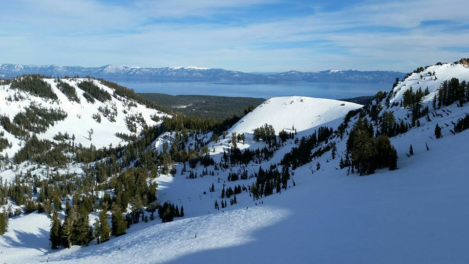

<h2>About</h2>     
<ul>

My name is Adam Jenkins, and I’m a third-year computer science major at CSU, Chico. When I’m not <a href="/projects.html" target="_blank">programming</a> (either for school or just for fun), I enjoy gaming, biking, skiing, and hanging out with my pets. In addition to older titles such as Oblivion and Skyrim, I also enjoy tabletop gaming with friends, especially if <a href="https://www.fantasyflightgames.com/en/eldritch-horror-showcase/" target="_blank">Eldritch Horror</a> is involved.

Outside of computers and/or gaming, I am a huge fan of my cats and dog, who, despite my attempt to take one of them with me, still live back in Pacifica with my parents and younger brother. I do also follow politics fairly closely, though the more I read, the more I like my pets.

</ul>
<figure>

<figcaption>This is a picture from the top of the mountain in Alpine Medows Ski Resort. The family  and I were able to take the trip Winter 2015.</figcaption>
</figure>
