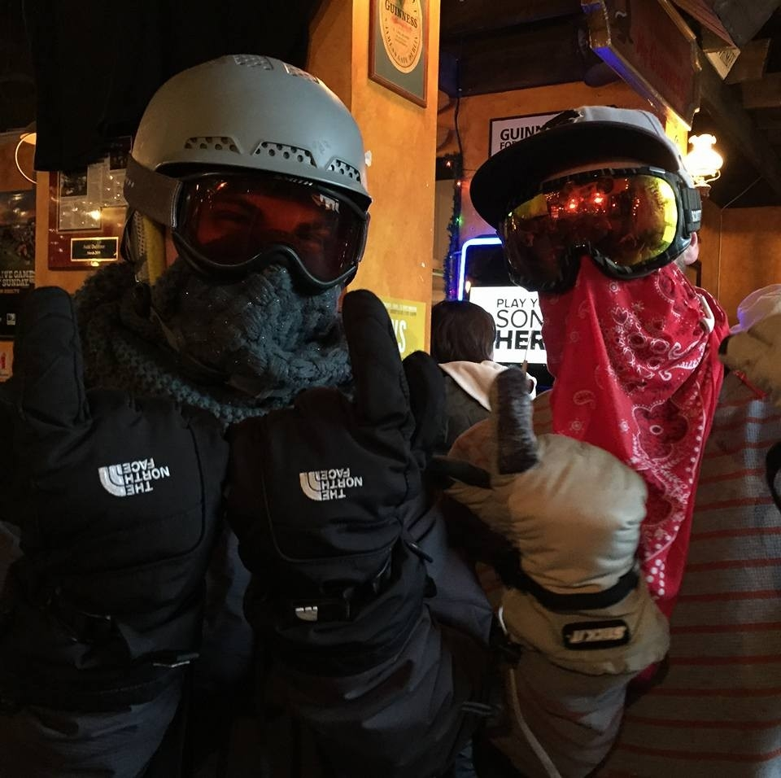

<h1>Welcome</h1>

...to my little corner of the web

<!-- 
...to my little corner of the web
 -->

<a class="btn btn-primary btn-large" href = "/work.html">Learn More &raquo; </a>

<!-- Main hero unit for a primary marketing message or call to action -->

<h2>About</h2>

Just a little bit about me

 

<a class="btn" href="/about.html">View details &raquo;</a>

<h2>CSU, Chico</h2>

Currently working towards a BS in Computer Science at CSU, Chico

<a class="btn" href="/school.html">View details &raquo;</a>

<h2>Projects</h2>

All of the relevant projects I've completed can be found here
 <!-- ' -->

<a class="btn" href="/projects.html">View details &raquo;</a>

 
